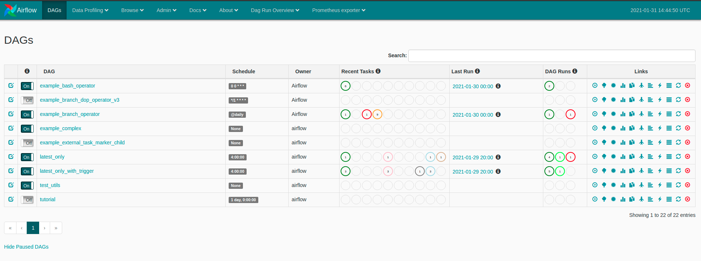
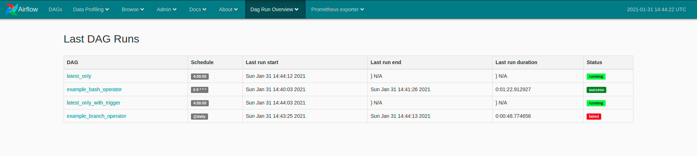

# Airflow DAG Run Overview Plugin

Plugin giving a high level overview of the state of the latest runs of your Airflow DAGs. 
Allowing non-technical team members to gain insight into the current state of data pipelines without the need for training on Airflow's (sometimes confusing) UI.

Rather than confusing non-technical users with multiple states per DAG.

Give them a high level overview of the last run runs without any noise.

## To install

1. Ensure you have a plugin directory configured for airflow (`AIRFLOW__CORE__PLUGINS_FOLDER=/path/to/airflow/plugins`)
2. Clone this project into the plugin directory`git clone git@github.com:niross/airflow-dag-run-overview-plugin.git /path/to/airflow/plugins/airflow-dag-run-overview`
